# 12-02_ddl_dml
HW_12-02_DDL/DML

# Домашнее задание к занятию 2 «Работа с данными (DDL/DML)»

### Задание 1.
1.1. Поднимите чистый инстанс MySQL версии 8.0+. Можно использовать локальный сервер или контейнер Docker:

Установим **MySQL** на виртуальной машине **Debian 11.6**, которая будет использоваться в качестве локального
сервера.

- Добавим **MySQL APT-репозиторий** в системный список репозиториев, предварительно скачав **mysql-apt-config_0.8.26-1_all.deb**
  с официального сайта [MySQL Community Downloads](https://dev.mysql.com/downloads/file/?id=521319) :
```
sudo dpkg -i ./mysql_apt-config/mysql-apt-config_0.8.26-1_all.deb
```
<kbd>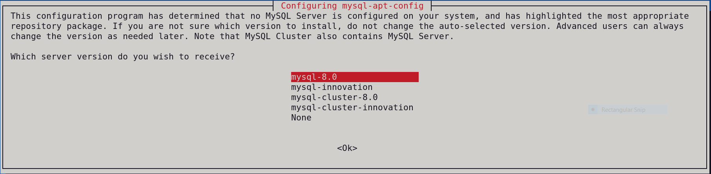</kbd>  

- Обновление **APT-кэша**:
```
sudo apt update
```
<kbd>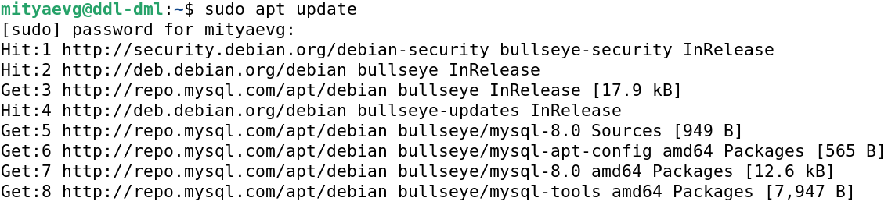</kbd>
- Установка **MySQL** с помощью **APT**:
```
sudo apt install mysql-server
```
- Зададим пароль для рута:
  
<kbd>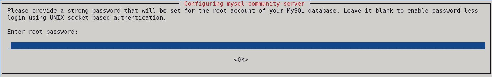</kbd>

- После инсталляции **MySQL** проверим версию установленного продукта:
```
mysql -V
```
<kbd>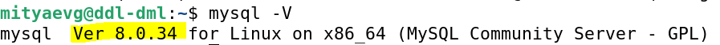</kbd>

- Проверим статус работы сервиса **mysql.service**:
```
systemctl status mysql.service
```
<kbd>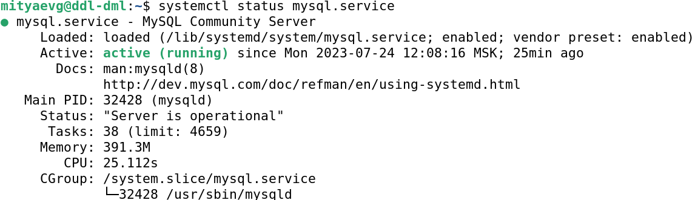</kbd>

1.2. Создайте учётную запись sys_temp.
- Зайдем в консоль **MySQL** под пользователем **root**:
```
sudo mysql -u root -p
```
<kbd>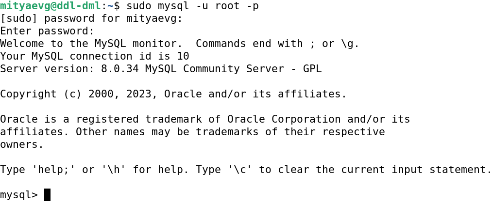</kbd>

- Создадим пользователя **sys_temp** c паролем **12345**:
```
CREATE USER 'sys_temp'@'localhost' IDENTIFIED BY '12345';
```
<kbd>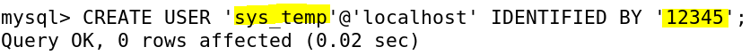</kbd>

1.3. Выполните запрос на получение списка пользователей в базе данных. (скриншот):
```
SELECT user FROM mysql.user;
```
<kbd>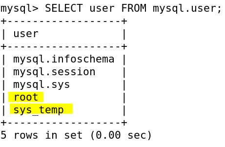</kbd>

1.4. Дайте все права для пользователя sys_temp:
```
GRANT ALL PRIVILEGES ON *.* TO 'sys_temp'@'localhost';
```
<kbd>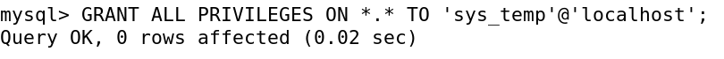</kbd>

1.5. Выполните запрос на получение списка прав для пользователя sys_temp. (скриншот):
```
SHOW GRANTS FOR 'sys_temp'@'localhost';
```
<kbd>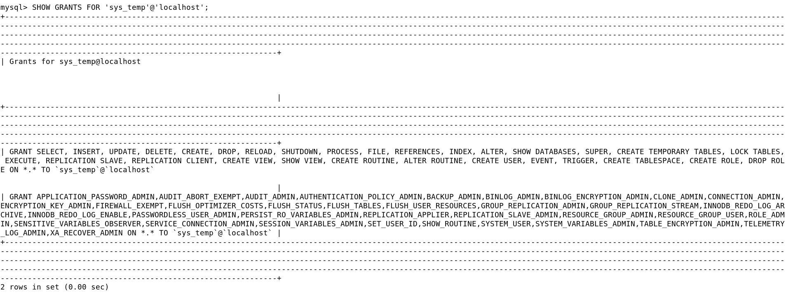</kbd>

1.6. Переподключитесь к базе данных от имени sys_temp:
```
sudo mysql -u systemp -p
```
<kbd>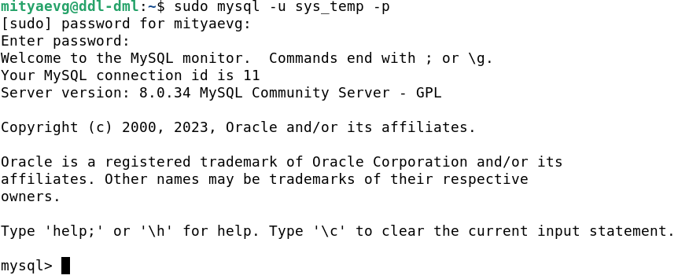</kbd>

- Создадим новую базу данных **dvdrental**:
```
CREATE DATABASE dvd_rental;
```
<kbd>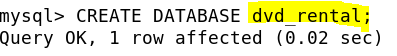</kbd>

- Проверим список баз данных в системе:
```
SHOW DATABASES;
```
<kbd>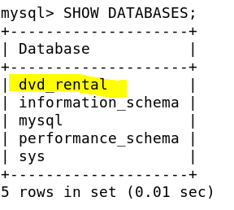</kbd>

- По ссылке https://downloads.mysql.com/docs/sakila-db.zip скачайте дамп базы данных и распакуем архив
  **sakila-db.zip** в директорию **/home/mityaevg/sakila-db**:
```
https://downloads.mysql.com/docs/sakila-db.zip
unzip sakila-db.zip
ls -l ./sakila-db
```
<kbd>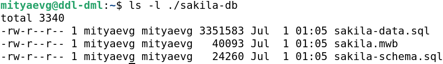</kbd>

1.7. Восстановите дамп в базу данных:

- Сначала скачаем и установим программу **DBeaver**:
```
wget https://dbeaver.io/files/dbeaver-ce_latest_amd64.deb
sudo dpkg -i  dbeaver-ce_latest_amd64.deb
dbeaver &
```
- Восстановим дамп в базу **dvd_rental**:

<kbd>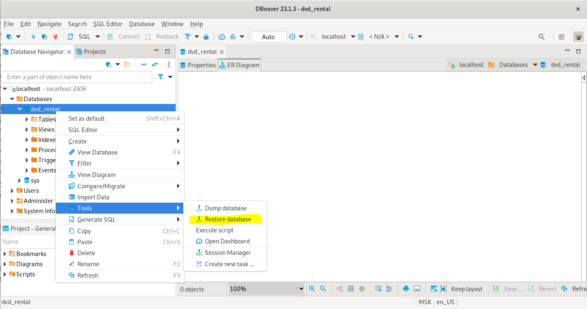</kbd>
```
/usr/bin
```

- Сначала импортируем **/home/mityaevg/sakila-db/sakila-schema.sql**:

<kbd>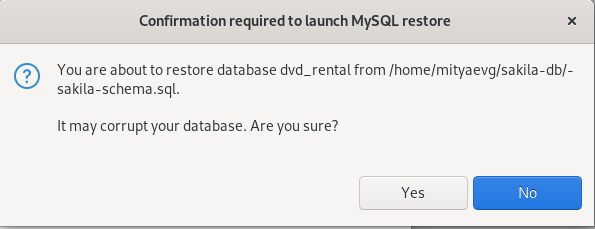</kbd>

- Затем импортируем **/home/mityaevg/sakila-db/sakila-data.sql**:

<kbd>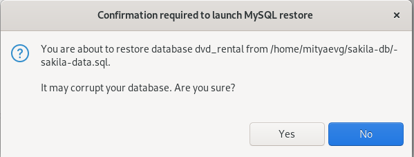</kbd>

1.8. При работе в IDE сформируйте ER-диаграмму получившейся базы данных:

<kbd>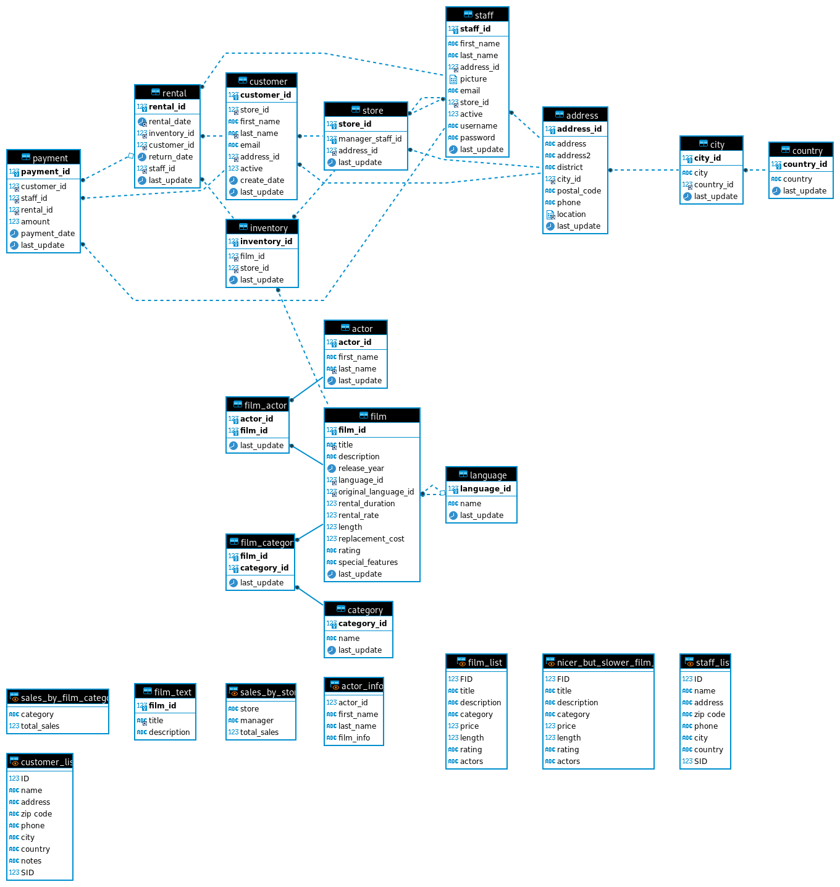</kbd>

### Задание 2.
Составьте таблицу, используя любой текстовый редактор или Excel, в которой должно быть два столбца: в первом должны быть названия таблиц восстановленной базы, во втором названия первичных ключей этих таблиц. Пример: (скриншот/текст).


